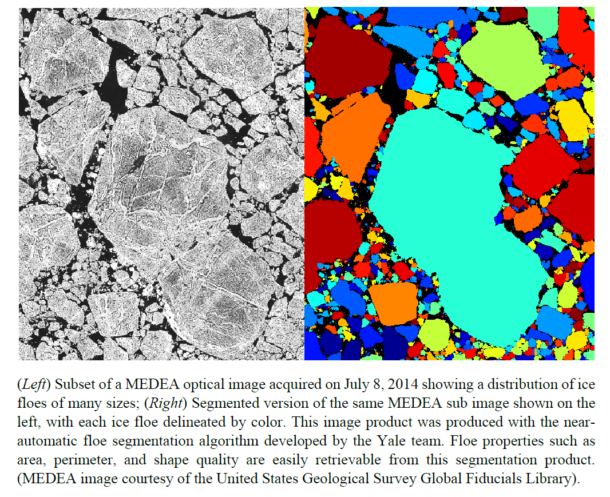

# Projects

## Observational Data Analysis

The Observational Data Analysis group is analyzing both remote sensing and in-situ data to understand the scales of variability of sea-ice floes and the ocean dynamics in the boundary layer beneath sea ice. Individual sea-ice floes have been characterized in high-resolution optical satellite imagery through the development of an automated floe segmentation procedure. The evolution of the sea-ice floe field is quantified in Beaufort Sea imagery, and interpreted in conjunction with in-situ measurements from the region, including Ice-Profiling Sonar records. Ocean dynamics as they relate to sea ice are examined using Ice-Tethered Profiler measurements of upper-ocean temperature and salinity. These observational analyses provide parameter constraints and validation of the modeling efforts across the other MURI teams.

