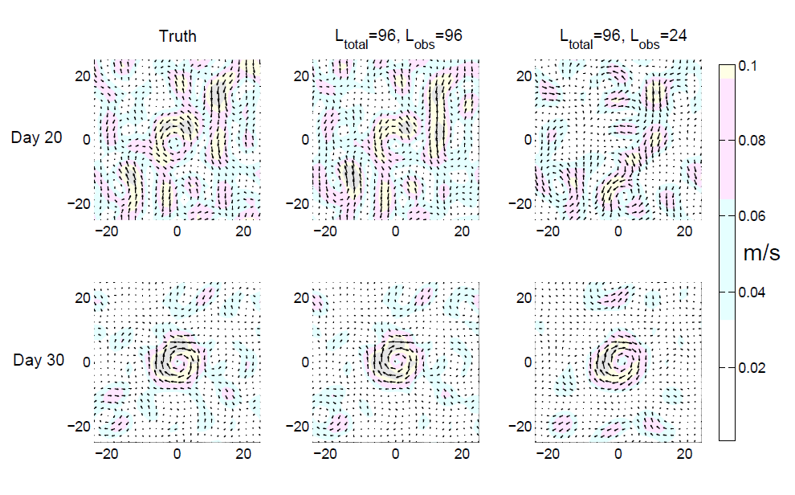

# Projects

## Observational analyses of sea ice and ocean dynamics

The Observational Data Analysis group is analyzing both remote sensing and in-situ data to understand the scales of variability of sea-ice floes and the ocean dynamics in the boundary layer beneath sea ice. Individual sea-ice floes have been characterized in high-resolution optical satellite imagery through the development of an automated floe segmentation procedure. The evolution of the sea-ice floe field is quantified in Beaufort Sea imagery, and interpreted in conjunction with in-situ measurements from the region, including Ice-Profiling Sonar records. Ocean dynamics as they relate to sea ice are examined using Ice-Tethered Profiler measurements of upper-ocean temperature and salinity. These observational analyses provide parameter constraints and validation of the modeling efforts across the other MURI teams.

## Data assimilation and UQ team

The Data assimilation and UQ team is currently focusing on two projects: 1) Data assimilation and 2) Uncertainty quantification (UQ) for coupled atmosphere, ocean and sea ice model. The data assimilation project aims at designing efficient and accurate filters to improve the state estimation of the atmosphere and ocean flow fields using the observed Lagrangian trajectories of the sea ice floes. Estimating model parameters and the associated statistics (e.g., sea ice thickness distribution) also belongs to the data assimilation framework. The goal of the UQ project is to explore the role of the atmosphere and ocean in affecting the sea ice dynamics and the associated prediction skill. It also aims at exploring the uncertainty and model error in various cheap and practically useful stochastic parameterizations.

## Discete element methods development team

Here, we present a new discrete-element ice floe model that will explicitly simulate interactions between individual floes as opposed to developing continuous rheology. Our goal is to develop a versatile sea ice model that could be used in conjunction with floe-scale satellite and in situ observations for short-term sea ice predictions, data assimilation, parameter estimation, uncertainty quantification as well as to explore various atmosphere-ocean-ice processes occurring at floe scales. While the ice floe model consists of several mechanical and thermodynamic components, our focus is to develop a set of floe interaction rules that can lead to realistic sea ice mechanics, including the realistic distributions of fractures, sizes, thicknesses, and shapes. This model includes the implementation of various physical processes affecting evolution of floes in the model including collisions, fractures, creation of new floes and packing algorithm, dilution of floes and an Eulerian variable for keeping track of the unresolved small-scale floe, welding, and ridging.

